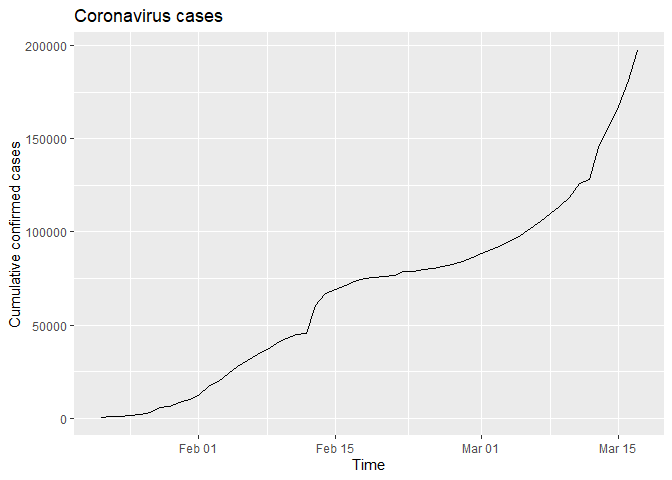
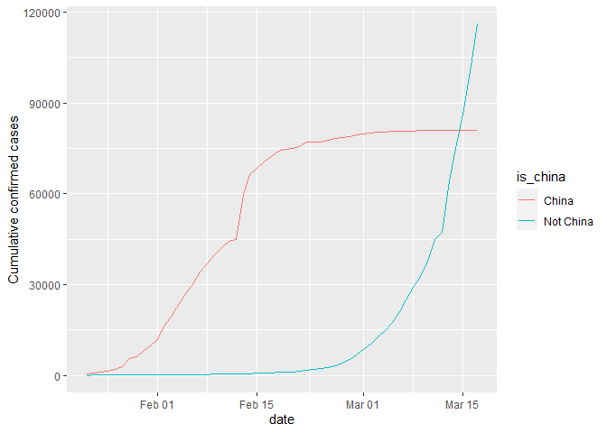
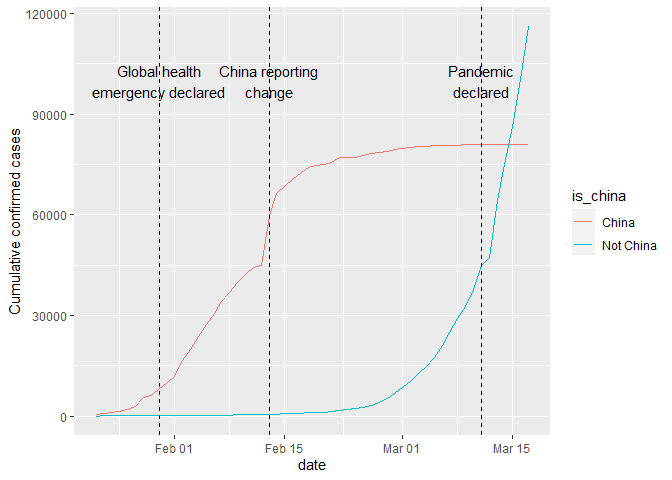
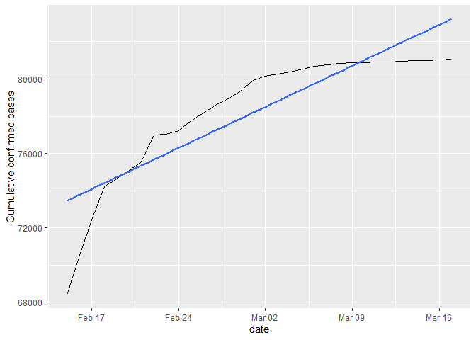
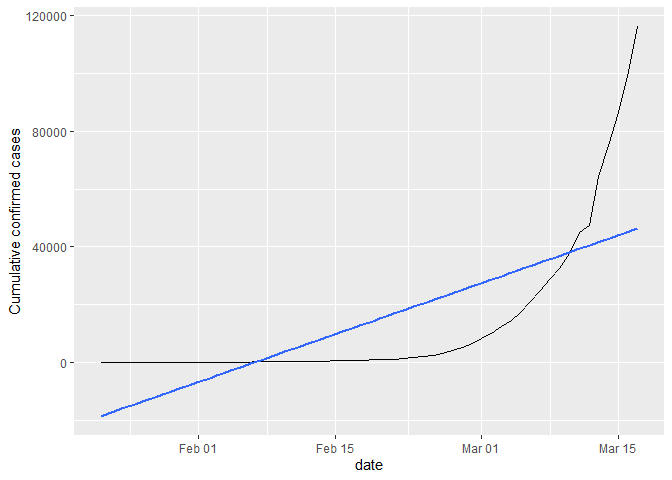
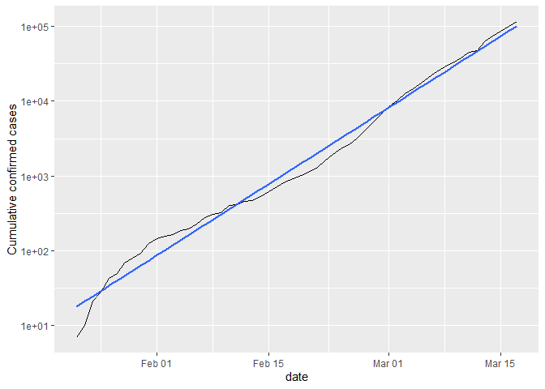
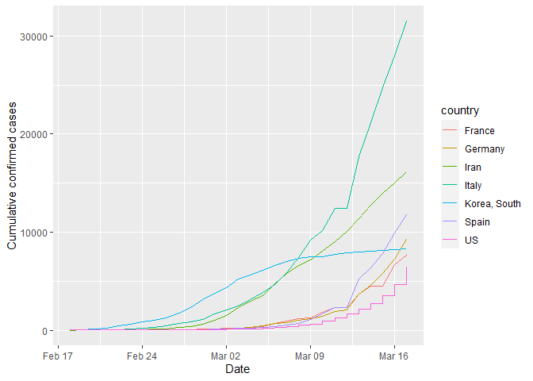

# Visualising COVID-19 (Project by DataCamp)

[LINK TO PROJECT](https://projects.datacamp.com/projects/870)

    # This R environment comes with many helpful analytics packages installed
    # It is defined by the kaggle/rstats Docker image: https://github.com/kaggle/docker-rstats
    # For example, here's a helpful package to load

    library(tidyverse) # metapackage of all tidyverse packages

    ## -- Attaching packages --------------------------------------- tidyverse 1.3.1 --

    ## v ggplot2 3.3.5     v purrr   0.3.4
    ## v tibble  3.1.4     v dplyr   1.0.7
    ## v tidyr   1.1.4     v stringr 1.4.0
    ## v readr   2.0.2     v forcats 0.5.1

    ## -- Conflicts ------------------------------------------ tidyverse_conflicts() --
    ## x dplyr::filter() masks stats::filter()
    ## x dplyr::lag()    masks stats::lag()

    # Input data files are available in the read-only "../input/" directory
    # For example, running this (by clicking run or pressing Shift+Enter) will list all files under the input directory

    # list.files(path = "../input") # to read files in the interface

    # You can write up to 5GB to the current directory (/kaggle/working/) that gets preserved as output when you create a version using "Save & Run All" 
    # You can also write temporary files to /kaggle/temp/, but they won't be saved outside of the current session

    confirmed_cases_worldwide <- read_csv("visualizing-covid-19-datasets/confirmed_cases_worldwide.csv")

    ## Rows: 56 Columns: 2

    ## -- Column specification --------------------------------------------------------
    ## Delimiter: ","
    ## dbl  (1): cum_cases
    ## date (1): date

    ## 
    ## i Use `spec()` to retrieve the full column specification for this data.
    ## i Specify the column types or set `show_col_types = FALSE` to quiet this message.

    # Analyzing confirmed cases worldwide
    glimpse(confirmed_cases_worldwide)

    ## Rows: 56
    ## Columns: 2
    ## $ date      <date> 2020-01-22, 2020-01-23, 2020-01-24, 2020-01-25, 2020-01-26,~
    ## $ cum_cases <dbl> 555, 653, 941, 1434, 2118, 2927, 5578, 6166, 8234, 9927, 120~

    # Drawing line plot of cumulative cases vs. date
    ggplot(data = confirmed_cases_worldwide, mapping = aes(x = date, y = cum_cases)) + 
        geom_line() + 
        labs(y = "Cumulative confirmed cases", x = "Time", title = "Coronavirus cases")

    # Reading confirmed_cases_china_vs_world.csv 
    confirmed_cases_china_vs_world <- read_csv("visualizing-covid-19-datasets/confirmed_cases_china_vs_world.csv")

    ## Rows: 112 Columns: 4

    ## -- Column specification --------------------------------------------------------
    ## Delimiter: ","
    ## chr  (1): is_china
    ## dbl  (2): cases, cum_cases
    ## date (1): date

    ## 
    ## i Use `spec()` to retrieve the full column specification for this data.
    ## i Specify the column types or set `show_col_types = FALSE` to quiet this message.

    # Glimpse of data
    glimpse(confirmed_cases_china_vs_world)

    ## Rows: 112
    ## Columns: 4
    ## $ is_china  <chr> "China", "China", "China", "China", "China", "China", "China~
    ## $ date      <date> 2020-01-22, 2020-01-23, 2020-01-24, 2020-01-25, 2020-01-26,~
    ## $ cases     <dbl> 548, 95, 277, 486, 669, 802, 2632, 578, 2054, 1661, 2089, 47~
    ## $ cum_cases <dbl> 548, 643, 920, 1406, 2075, 2877, 5509, 6087, 8141, 9802, 118~

    # A line plot of cumulative cases vs. date, grouped and colored by is_china
    plt_cum_confirmed_cases_china_vs_world <- ggplot(confirmed_cases_china_vs_world) +
      geom_line(aes(date, cum_cases, color=is_china)) +
      ylab("Cumulative confirmed cases")

    # Plotting
    plt_cum_confirmed_cases_china_vs_world

    who_events <- tribble(
      ~ date, ~ event,
      "2020-01-30", "Global health\nemergency declared",
      "2020-03-11", "Pandemic\ndeclared",
      "2020-02-13", "China reporting\nchange"
    ) %>%
      mutate(date = as.Date(date))

    # Using who_events, adding vertical dashed lines with an xintercept at date, and text at date, labeled by event, and at 100000 on the y-axis
    plt_cum_confirmed_cases_china_vs_world + geom_vline(aes(xintercept = date), data = who_events, linetype = "dashed") + geom_text(aes(x = date, label = event), data = who_events, y = 1e5)    

    # Filtering for China, from Feb 15
    china_after_feb15 <- confirmed_cases_china_vs_world %>% filter(is_china == "China", date >= "2020-02-15")

    # Using china_after_feb15, drawing a line plot cum_cases vs. date and adding a smooth trend line using linear regression with no error bars
    ggplot(data = china_after_feb15, mapping = aes(x = date, y = cum_cases)) + geom_line() + geom_smooth(method = "lm", se = FALSE) + ylab("Cumulative confirmed cases")

    ## `geom_smooth()` using formula 'y ~ x'

    # Filtering confirmed_cases_china_vs_world for not China
    not_china <- filter(confirmed_cases_china_vs_world, is_china == "Not China")

    # Using not_china, drawing a line plot cum_cases vs. date, adding a smooth trend line using linear regression, no error bars
    plt_not_china_trend_lin <- ggplot(data = not_china, aes(x = date, y = cum_cases)) + geom_line() + geom_smooth(method = "lm", se = FALSE) + ylab("Cumulative confirmed cases")

    # Plotting
    plt_not_china_trend_lin 

    ## `geom_smooth()` using formula 'y ~ x'

    # Modifying the plot to use a logarithmic scale on the y-axis
    plt_not_china_trend_lin + scale_y_log10()

    ## `geom_smooth()` using formula 'y ~ x'

    # Reading confirmed cases by country
    confirmed_cases_by_country <- read_csv("visualizing-covid-19-datasets/confirmed_cases_by_country.csv")

    ## Rows: 13272 Columns: 5

    ## -- Column specification --------------------------------------------------------
    ## Delimiter: ","
    ## chr  (2): country, province
    ## dbl  (2): cases, cum_cases
    ## date (1): date

    ## 
    ## i Use `spec()` to retrieve the full column specification for this data.
    ## i Specify the column types or set `show_col_types = FALSE` to quiet this message.

    glimpse(confirmed_cases_by_country)

    ## Rows: 13,272
    ## Columns: 5
    ## $ country   <chr> "Afghanistan", "Albania", "Algeria", "Andorra", "Antigua and~
    ## $ province  <chr> NA, NA, NA, NA, NA, NA, NA, NA, NA, NA, NA, NA, NA, NA, NA, ~
    ## $ date      <date> 2020-01-22, 2020-01-22, 2020-01-22, 2020-01-22, 2020-01-22,~
    ## $ cases     <dbl> 0, 0, 0, 0, 0, 0, 0, 0, 0, 0, 0, 0, 0, 0, 0, 0, 0, 0, 0, 0, ~
    ## $ cum_cases <dbl> 0, 0, 0, 0, 0, 0, 0, 0, 0, 0, 0, 0, 0, 0, 0, 0, 0, 0, 0, 0, ~

    # Grouping by country, summarizing to calculate total cases for top 7 countries
    top_countries_by_total_cases <- confirmed_cases_by_country %>%
      group_by(country) %>%
      summarize(total_cases = max(cum_cases)) %>%
      top_n(n = 7)

    ## Selecting by total_cases

    # Plotting
    top_countries_by_total_cases

    ## # A tibble: 7 x 2
    ##   country      total_cases
    ##   <chr>              <dbl>
    ## 1 France              7699
    ## 2 Germany             9257
    ## 3 Iran               16169
    ## 4 Italy              31506
    ## 5 Korea, South        8320
    ## 6 Spain              11748
    ## 7 US                  6421

    # Reading data for top 7 countries
    confirmed_cases_top7_outside_china <- read_csv("visualizing-covid-19-datasets/confirmed_cases_top7_outside_china.csv")

    ## Rows: 2030 Columns: 3

    ## -- Column specification --------------------------------------------------------
    ## Delimiter: ","
    ## chr  (1): country
    ## dbl  (1): cum_cases
    ## date (1): date

    ## 
    ## i Use `spec()` to retrieve the full column specification for this data.
    ## i Specify the column types or set `show_col_types = FALSE` to quiet this message.

    # Glimpse
    glimpse(confirmed_cases_top7_outside_china)

    ## Rows: 2,030
    ## Columns: 3
    ## $ country   <chr> "Germany", "Iran", "Italy", "Korea, South", "Spain", "US", "~
    ## $ date      <date> 2020-02-18, 2020-02-18, 2020-02-18, 2020-02-18, 2020-02-18,~
    ## $ cum_cases <dbl> 16, 0, 3, 31, 2, 13, 13, 13, 13, 13, 13, 13, 13, 13, 13, 13,~

    # Using confirmed_cases_top7_outside_china, drawing a line plot of cum_cases vs. date, grouped and colored by country
    ggplot(data = confirmed_cases_top7_outside_china, aes(x = date, y = cum_cases)) + 
        geom_line(mapping = aes(x = date, y = cum_cases, color = country)) + 
        ylab("Cumulative confirmed cases") + xlab("Date")

